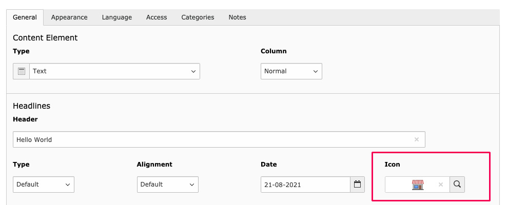
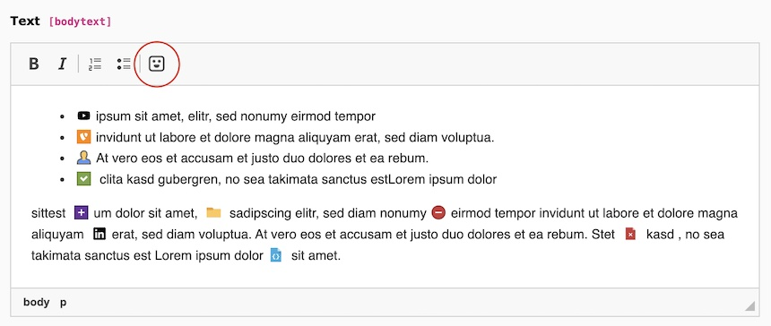
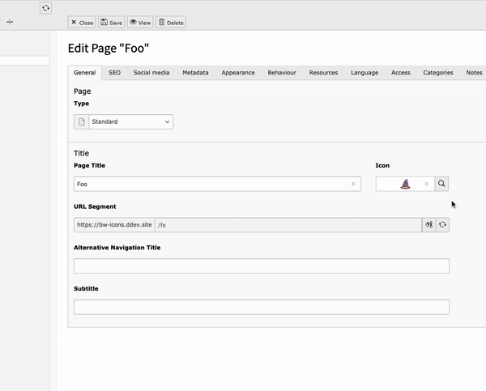

TYPO3 Icon Picker
=================

Icon selection for TCA and RTE. Generates a browsable gallery of your icon fonts and SVGs - just link your stylesheet or image directory. Works with FontAwesome, Bootstrap, Icomoon.. Optionally adds icon field to pages, tt_content and sys_category.

Features
--------

* Icon Picker TCA form element
* Icon field for tt_content, pages and sys_category
* RTE plugin
* Icon gallery with filter function
* Displays icons from image files and font (css)
* Works with remote css files
* Extracts and caches font styles (css)
* Can include generated stylesheet in the frontend

.. tip::

   Use your Icomoon development file. Your Icon Picker is always up to date, and you can serve the font files from your own remote without manually downloading and adjusting paths!

Demo
----

Installation
------------

.. rst-class:: bignums-tip

1. Install via composer

   .. code:: bash

      composer require blueways/bw-icons

   Or install via Extension Manager, in this case you can skip step 2.

2. Update database schema

   Make sure the extension is enabled in the Extension Manager. Do a database schema compare and update to add a new field in tt_content and pages table.

3. Include PageTS

   Include the **static PageTS** for TYPO3 core icons or set up your own icons. See Configuration :ref:`configuation` section.

4. Enable icons for tt_content, pages and/or sys_category

   In the extension settings (:kbd:`Admin Tools` → :kbd:`Extension Configuration` → :kbd:`bw_icons`), you can enable the icon fields.
   If you want to use it for other tables, see :ref:`for_devs` section.

5. Include RTE configuration (optional)

   .. code:: yaml

      imports:
         - { resource: EXT:bw_icons/Configuration/RTE/IconPicker.yaml }

      editor:
         config:
           toolbar:
             - { name: 'icon', items: [IconPicker] }

.. _configuation:

Configuration
-------------

The displayed icons are set up via PageTS. Choose a unique identifier and select :file:`FileIconProvider` if you want to add image files from a directory or :file:`CssIconProvider` if you want to display font icons from a stylesheet.

.. code:: typoscript

	mod.tx_bwicons {

		# Get icons from directory and subdirectory. Subdirectories become sidebar links.
		typo3icons = Blueways\BwIcons\Provider\FileIconProvider
		typo3icons {
			title = TYPO3 Icons
			folder = EXT:core/Resources/Public/Icons/T3Icons/svgs
		}

		# Get icons from stylesheet. Multiple font-faces in one file become sidebar links.
		fontawesome = Blueways\BwIcons\Provider\CssIconProvider
		fontawesome {
			title = FontAwsome
			file = fileadmin/fontawesome/css/all.css
		}

		# Get icons from remote stylesheet. Styles and font files are cached in /typo3temp
		icomoon = Blueways\BwIcons\Provider\CssIconProvider
		icomoon {
			title = Icomoon
			file = https://i.icomoon.io/public/b23ec64zea/Project/style.css
		}
	}

When using :file:`FileIconProvider`, it's possible to specify a comma separated list of file extension you want to use (e.g. :file:`svg` oder :file:`png`) with the :file:`fileExtensionList` option.

.. code:: typoscript

	mod.tx_bwicons {
		svgicons = Blueways\BwIcons\Provider\FileIconProvider
		svgicons {
			title = Custom SVG Icons
			folder = fileadmin/icons
			fileExtensionList = svg
		}

		pngicons = Blueways\BwIcons\Provider\FileIconProvider
		pngicons {
			title = Custom PNG Icons
			folder = fileadmin/icons
			fileExtensionList = png
		}
	}

.. note::

   After changing the settings, make sure to clear the cache.

Usage
-----

The icons are saved as filename (e.g. :file:`EXT:myext/Resources/Public/Images/icon.svg` or :file:`fileadmin/icons/foo.png`) if you use the :file:`FileIconProvider` or as css class names (e.g. :file:`fas fa-arrow-right`) by using :file:`CssIconProvider`.

If you have configured only the selection of SVGs, you can safely use the :file:`<f:image src="{data.tx_bwicons_icon}" />` viewHelper in your fluid template.

By only using font icons, you can output like :file:`<i class="{data.tx_bwicons_icon}"></i>`.

If you have a mixture, you can use my ViewHelper that determines the type by checking for a dot in the icon name:

.. code:: html

	{namespace bw=Blueways\BwIcons\ViewHelpers}

	<bw:icon icon="{data.tx_bwicons_icon}" /> Hello world!

Output:

.. code:: html

	<i class="fa fas-wave"></i> Hello world!

or

.. code:: html

    Hello world!

Frontend Include (optional)
---------------------------

If you want to include the extracted styles in the frontend, you can use the :file:`CssUtility` to generate the style-tags in the head of your page. Include this in your **TypoScript setup**:

.. code:: typoscript

   page.headerData {
      123 = USER
      123.userFunc = Blueways\BwIcons\Utility\CssUtility->includeStyleSheets
   }

.. _for_devs:

For developers
--------------

Usage in other tables
~~~~~~~~~~~~~~~~~~~~~

.. rst-class:: bignums-tip

1. Create database field for the icon:

   .. code:: sql

      create table tx_myext_domain_model_foo (
         icon_field varchar(255) not null default '',
      );

2. Adjust TCA

   Add the renderType :file:`iconSelection` in the config array:

   .. code:: php

      'icon_field' => [
         'label' => 'My Icon',
         'config' => [
            'type' => 'input',
            'renderType' => 'iconSelection'
         ]
      ],

   Optional: you may restrict which icon providers are available:

   .. code:: php

      'icon_field' => [
         'label' => 'My Icon',
         'config' => [
            'type' => 'input',
            'renderType' => 'iconSelection',
            'iconProviders' => 'fontawesome,otherProviderKey'
         ]
      ],

New icon sources
~~~~~~~~~~~~~~~~

If you want to add other icon sources (e.g. from API), you can create your own IconProvider. Just make sure to extend from :file:`Blueways\BwIcons\Provider\AbstractIconProvider`.

Help & Contribution
-------------------

This extension was made by Maik Schneider. Use the `issue tracker <https://github.com/maikschneider/bw_icons/issues>`__ for bugs and feature requests. If you have any questions, you can `hit me up <https://slack.com/app_redirect?channel=C02KWTE8JRE>`__ at the TYPO3 Slack.

Feel free to contribute!

* `Github-Repository <https://github.com/maikschneider/bw_icons/>`__

Thanks to `blueways <https://www.blueways.de/>`__ and `XIMA <https://www.xima.de/>`__!
