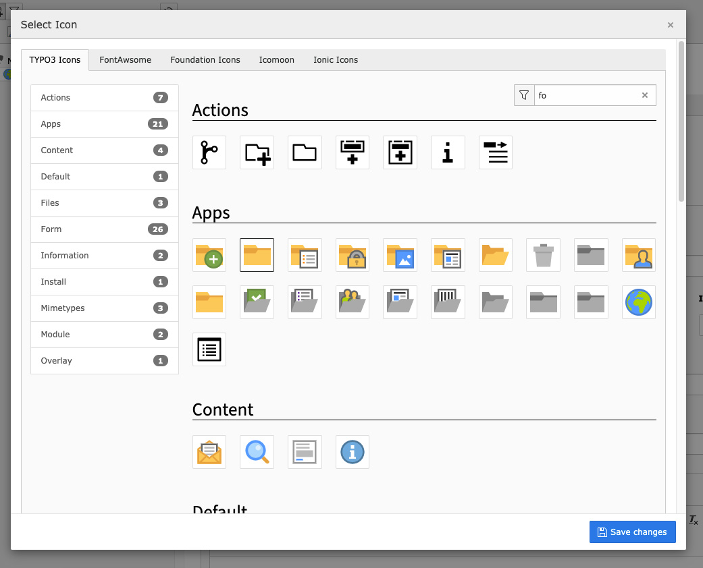

# Icon Selector

Form element for icon selection. Generates a browsable gallery of your icon fonts and SVGs - just link your stylesheet or image directory. Works with FontAwesome, Bootstrap,
Icomoon.. Optionally adds icon field to pages and tt_content.




## Installation

1. Install via composer

   ``` {.bash}
   composer require blueways/bw-icons
   ```

2. Include PageTS

   Enable the extension in the Extension Manager and include the **static PageTS** for TYPO3 core icons or set up your own icons. See [Configuration](#Configuration).
   
3. Enable icons for tt_content and/or pages

    In the extension settings (`Admin Tools → Extension Configuration → bw_icons`), you can enable the icon fields. If you want to use it for other tables, see [For developers](#For developers).


### Configuration

### For developers
